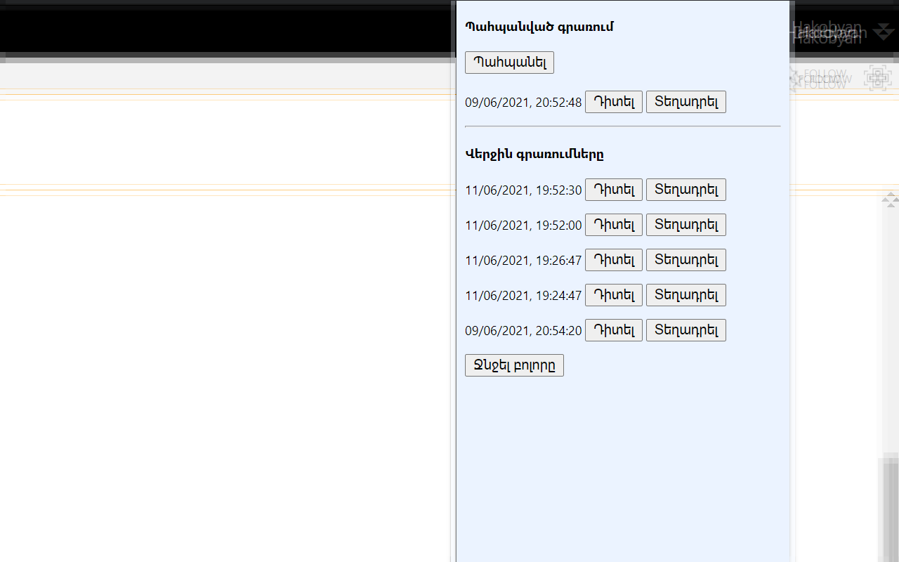

# SharePoint Reply Autosave
Այս պրոյեկտով սարքում եմ Extension, որը Sharepoint-ի քննրակումների սևագրերը ինքնապահպանում է ամեն 30 վայրկյան, ապա թույլ է տալիս վերականգնել։  
Այս պահին աշխատում է SharePoint 2016-ի համար։

## Extension-ի հավաքելու քայլերը
Chrome-ի և Firefox-ի համար հարկավոր է միայն zip սարքել `src` պնակի պարունակությունը։  
Microsoft Edge-ում աշխատում է Chrome-ի տարբերակը Web Store-ից։